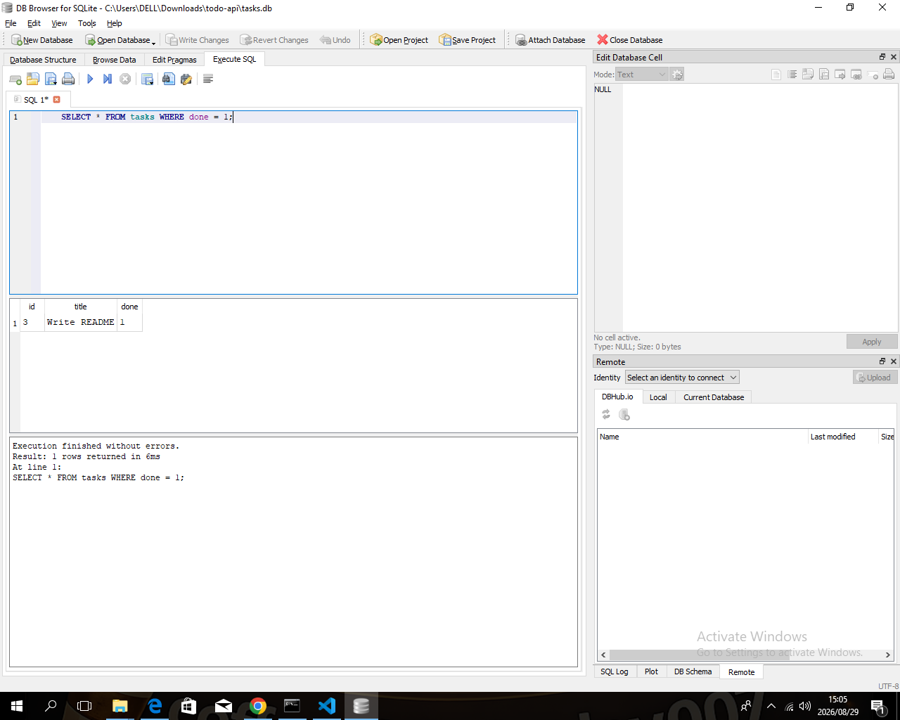

# Task API — CRUD To-Do API (BE-01 + BE-02)

A REST API for managing tasks, built for FlyRank's Backend AI Engineering
track. Started as an in-memory CRUD API (BE-01), now backed by a real
SQLite database (BE-02) — the API itself never changed, only the storage
layer underneath it.

## Run it

```bash
npm install
node index.js
```

Server starts at `http://localhost:3000`. Swagger UI (interactive docs) is
at `http://localhost:3000/docs`.

The first time you run it, a `tasks.db` file is created automatically in
the project folder, with 3 seed tasks. Restarting the server does **not**
reset your data — that's the whole point of this stage.

## Why SQLite

SQLite was chosen because it needs no separate database server to install
or run — it's a single file (`tasks.db`) that the app creates automatically
on first run. That makes it ideal for a learning project like this one: it
proves the exact same persistence concepts a production Postgres or MySQL
setup would (tables, rows, SQL queries, surviving restarts) without any
setup overhead. The database file lives at the project root, alongside
`index.js`.

## Endpoints

| Method | Path | Description |
|---|---|---|
| GET | `/` | API info |
| GET | `/health` | Health check |
| GET | `/tasks` | List all tasks (supports `?done=true` and `?search=term`) |
| GET | `/tasks/:id` | Get a single task by id |
| POST | `/tasks` | Create a task — body: `{ "title": "..." }` |
| PUT | `/tasks/:id` | Update a task's `title` and/or `done` |
| DELETE | `/tasks/:id` | Delete a task |
| GET | `/stats` | `{ total, done, open }` counts (computed with SQL `COUNT`/`SUM`) |
| POST | `/reset` | Reset tasks back to the 3 seed items |

## Example

```
$ curl -i -X POST http://localhost:3000/tasks -H "Content-Type: application/json" -d '{"title":"Buy milk"}'

HTTP/1.1 201 Created
Content-Type: application/json; charset=utf-8

{"id":4,"title":"Buy milk","done":false}
```

## Database

- **File:** `tasks.db`, created automatically in the project root on first run.
- **Table:** `tasks` (`id` INTEGER PRIMARY KEY, `title` TEXT, `done` BOOLEAN), created automatically if missing.
- **Seeding:** 3 example tasks are inserted only if the table is empty — confirmed by restarting the server multiple times and checking the count never grows beyond what's actually created through the API.

### Example SQL query I ran directly against the database

```sql
SELECT * FROM tasks WHERE done = 1;
```

Result, before deleting completed tasks:
```
[ { id: 3, title: 'Write README', done: 1 } ]
```

I also ran `UPDATE tasks SET done = 1;` directly against the database file
(bypassing the API entirely) and confirmed `GET /tasks` immediately
reflected the change — proving the API is just a thin layer over the real
data, not a separate source of truth.

    

```markdown

```

## Notes

- Every write endpoint (`POST`, `PUT`) validates input and returns `400`
  with a JSON error message on bad input, never a silent failure.
- Unknown ids return `404` with a JSON error, never an empty `200`.
- `GET /tasks` supports `?done=true|false` and `?search=term` using real
  SQL `WHERE` and `LIKE` clauses, not in-memory filtering.

## What changed between BE-01 and BE-02

- The in-memory `tasks` array is gone — `db.js` now owns all data.
- Every endpoint that used to touch the array now runs a SQL query instead
  (`SELECT`, `INSERT`, `UPDATE`, `DELETE`).
- **The API contract itself did not change at all** — same paths, same
  request bodies, same response shapes, same status codes. This is the
  core lesson of the assignment: persistence is an implementation detail
  behind the API, not a change to the API.
